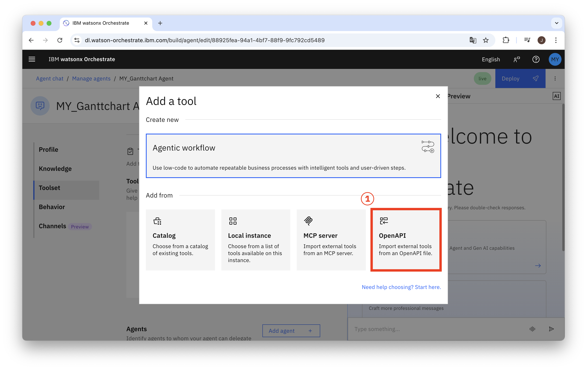
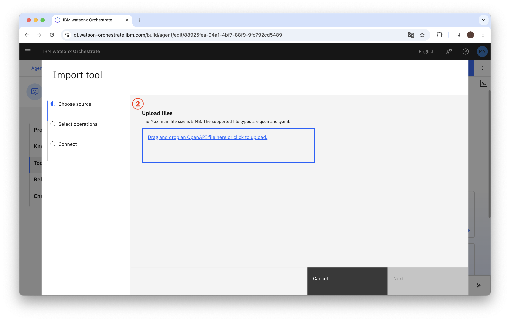
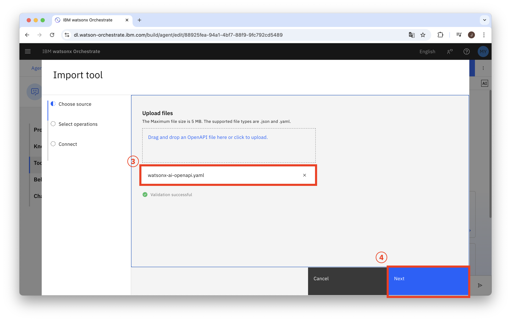
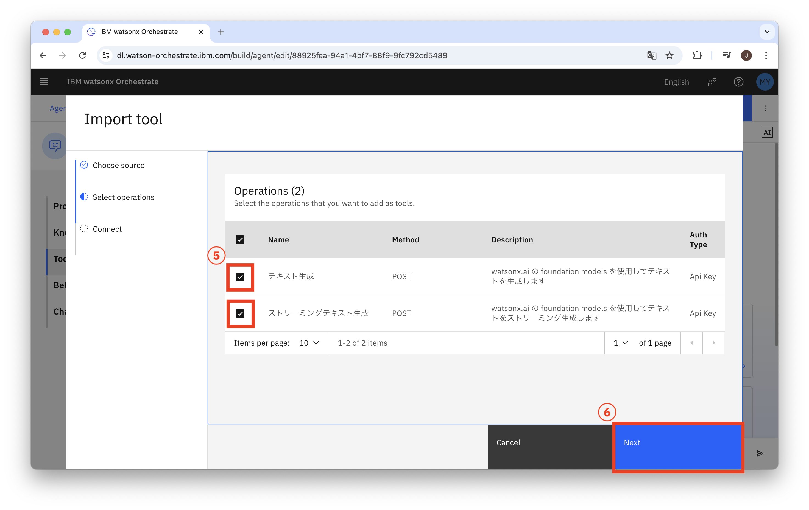
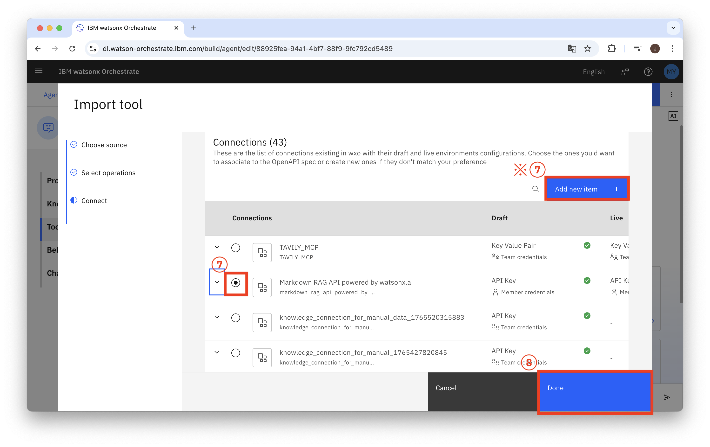
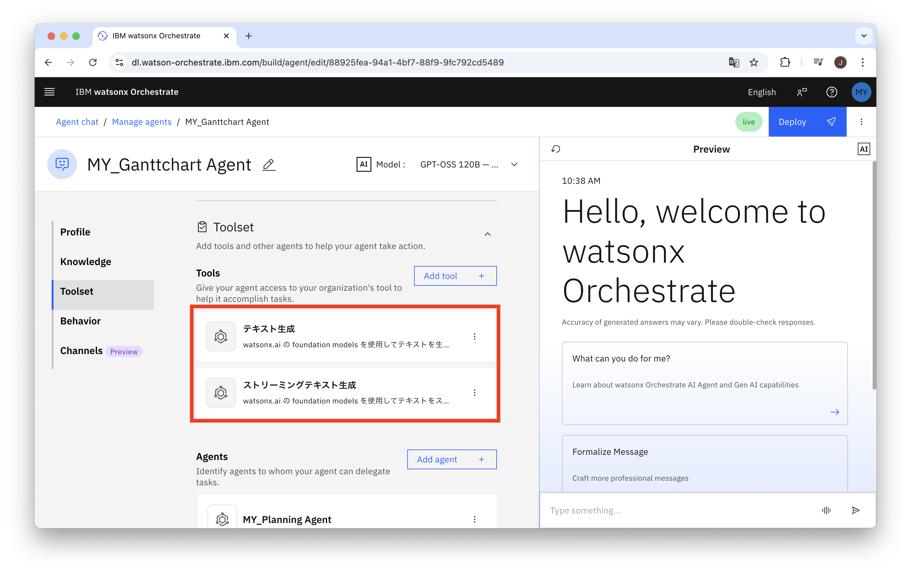

# watsonx.ai × watsonx Orchestrate 連携ガイド

watsonx.ai で作成したモデル（Agent）を、watsonx Orchestrate から API 経由で呼び出すための OpenAPI 定義ファイルと手順書です。

---

## 全体の流れ

```
① watsonx.ai でプロジェクト・モデルを用意
        ↓
② YAML ファイルに自分の情報を記入
        ↓
③ watsonx Orchestrate に Tool として登録
```

---

## ① watsonx.ai でプロジェクト・モデルを用意する

### 0. インスタンスの作成

 [watsonx.ai オンボーディングガイド](https://ibm.github.io/japan-technology/onboarding-docs/watsonx-ai/)の**インスタンス**を参考に、watsonx.aiの環境を準備

### 1-1. プロジェクトの作成

1. [IBM Cloud](https://cloud.ibm.com) にログインし、**watsonx.ai** を開く
2. 左メニューの **「すべてのプロジェクトの表示」→「新規プロジェクト+」** をクリック
3. プロジェクト名を入力して作成

> **プロジェクト ID の確認方法**  
> プロジェクト作成後、**「管理」→「一般」タブ** に表示される UUID をメモしておく  
> （例: `xxxxxxxx-xxxx-xxxx-xxxx-xxxxxxxxxxxx`）

### 1-2. 使用するモデルの確認

1. プロジェクト内の **「基盤モデルを使用したチャットとプロンプトの作成」**（Prompt Lab）を開く
2. 右上の **「モデルを選択」** から使用したいモデルを選択する
3. 右上の **「</>コードの表示」** を開き、一番下あたり"model_id"以降に記載の **モデル ID** をメモする

**よく使われるモデル ID の例:**

| モデル名 | モデル ID |
|----------|-----------|
| IBM Granite 3.3 8B | `ibm/granite-3-3-8b-instruct` |
| IBM Granite 3.3 2B | `ibm/granite-3-3-2b-instruct` |
| Llama 3.3 70B | `meta-llama/llama-3-3-70b-instruct` |
| Llama 3.1 8B | `meta-llama/llama-3-1-8b-instruct` |

### 1-3. リージョンの確認

先ほどと同様に、 **「</>コードの表示」** を開き、一番上curl以降に記載の **cURL** をメモする

>利用している watsonx.ai のリージョンに応じてエンドポイント URL が異なります。(以下は例)
>
>| リージョン | URL |
>|-----------|-----|
>| US South（ダラス）| `https://us-south.ml.cloud.ibm.com` |
>| EU GB（ロンドン）| `https://eu-gb.ml.cloud.ibm.com` |
>| EU DE（フランクフルト）| `https://eu-de.ml.cloud.ibm.com` |
>| AP North（東京）| `https://jp-tok.ml.cloud.ibm.com` |

---

## ② YAML ファイルに自分の情報を記入する

このリポジトリの `watsonx-ai-openapi.yaml` をダウンロードし、以下の **3箇所** を自分の環境の値に書き換えます。

### 変更箇所一覧

#### 1. サーバー URL（リージョン）

```yaml
# 変更前（デフォルト: US-South）
servers:
  - url: https://us-south.ml.cloud.ibm.com

# 変更例（東京リージョンを使う場合）
servers:
  - url: https://jp-tok.ml.cloud.ibm.com
```

#### 2. `model_id` のデフォルト値（2 箇所）

`/ml/v1/text/generation` と `/ml/v1/text/generation_stream` の両方を変更します。

```yaml
# 変更前
model_id:
  default: "YOUR_MODEL_ID"

# 変更例
model_id:
  default: "ibm/granite-3-3-8b-instruct"
```

#### 3. `project_id` のデフォルト値（2 箇所）

```yaml
# 変更前
project_id:
  default: "YOUR_PROJECT_ID"

# 変更例
project_id:
  default: "xxxxxxxx-xxxx-xxxx-xxxx-xxxxxxxxxxxx"
```

---

## ③ watsonx Orchestrate に Tool として登録する

### 3-1. Tool の追加

1. watsonx Orchestrate を起動し、Agent の作成画面へ進む
2. **「Toolset」→「Tools」→「Add Tool」** をクリック



3. **「Open API」** を選択

### 3-2. YAML ファイルのアップロード

4. ② で編集した `watsonx-ai-openapi.yaml` をアップロード




> **ファイル検証が通らない場合（✅ が表示されない）**
> - YAML の構文エラーがないか確認する
> - [IBM API Connect Toolkit (ICA)](https://www.ibm.com/docs/ja/api-connect) で仕様準拠を確認する
> - `YOUR_PROJECT_ID` / `YOUR_MODEL_ID` が正しく書き換えられているか確認する

### 3-3. Operation の選択



5. Agent に搭載したい機能を選択（通常はすべて選択）

### 3-4. Connection の選択



6. 接続先の API と同じ API キーを登録した **Connection** を選択する

> **Connection がない場合**  
> 右上の **「Add new item (※)」** から新規に API 連携を作成する  
> - 認証方式: Bearer Token  
> - トークン取得: IBM Cloud API キー → IAM トークン（`https://iam.cloud.ibm.com/identity/token`）

### 3-5. 完了確認



7. 「Operations」で選択した機能が一覧に表示されていれば登録完了 ✅

---

## ファイル構成

```
connect_wxo-wxai/
├── README.md                    # 本ドキュメント
├── watsonx-ai-openapi.yaml      # OpenAPI 定義ファイル（要カスタマイズ）
└── wxo-wxai_images/             # README 用スクリーンショット
```

---

## 参考リンク

- [watsonx.ai オンボーディングガイド（日本語）](https://ibm.github.io/japan-technology/onboarding-docs/watsonx-ai/)
- [watsonx.ai API リファレンス](https://cloud.ibm.com/apidocs/watsonx-ai)
- [watsonx Orchestrate ドキュメント](https://www.ibm.com/docs/ja/watsonx/watson-orchestrate)
- [IBM Cloud IAM トークン取得](https://cloud.ibm.com/docs/account?topic=account-iamtoken_from_apikey)